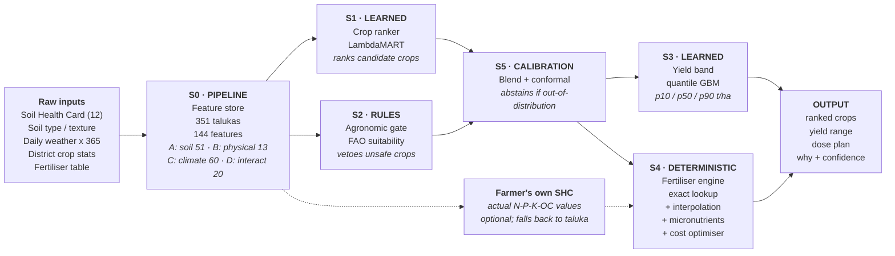

# Crop & Fertiliser Recommendation Engine

**A feature-engineering and model-training plan built on Soil Health Card data, taluka agro-climatology and district crop statistics — with an empirical benchmark of what this data can and cannot support.**

*Machine Learning System Design · Maharashtra*
Prepared for Dishan Jadhav · 26 August 2026

| 351 | 144 | 12 | 5 |
|:--|:--|:--|:--|
| Talukas in feature store | Engineered features | Soil components used | Connected model stages |

---

## Table of contents

1. [Executive summary](#01--executive-summary)
2. [What the data actually is](#02--what-the-data-actually-is)
3. [System architecture](#03--system-architecture)
4. [Feature engineering](#04--feature-engineering)
5. [Model specifications](#05--model-specifications)
6. [The fertiliser engine](#06--the-fertiliser-engine)
7. [Evaluation protocol & benchmark results](#07--evaluation-protocol--benchmark-results)
8. [Data upgrade path](#08--data-upgrade-path)
9. [Implementation roadmap](#09--implementation-roadmap)
10. [Repository structure](#10--repository-structure)

---

## 01 · Executive summary

Your five files can support a genuinely good recommendation system — but not the one a first pass would build. This plan is grounded in benchmarks I ran on your actual data, not on assumptions. Three results reshaped the design.

> ### ⚠️ The headline number is a mirage
>
> A LightGBM model predicting `Yield` from soil + weather scores **R² = 0.928**. That looks excellent. But a model given *only the crop name and season* — no soil, no weather — scores **R² = 0.925**. The model has learned that sugarcane yields 74 t/ha and sesamum yields 0.27 t/ha. It has learned nothing about soil or land. Report 0.928 in a viva and the first question will end the defence.

Stripping that scale effect out — predicting *within-crop* relative yield, validated with GroupKFold by district — the honest signal is **R² = 0.230**. That is real and well above zero, but it is the true ceiling of what this data supports for yield prediction.

> ### 🔑 The target definition matters more than the model
>
> Changing the model architecture moved accuracy by ±0.02. Changing *what you predict* moved ranking quality by **+0.28 NDCG@5** — fourteen times more. Predicting yield ranks crops at NDCG@5 = 0.216; predicting revealed cropping preference ranks them at 0.498; a LambdaMART ranker on engineered features reaches **0.724**. Most of the available improvement lives in problem formulation, not hyperparameters.

> ### Fertiliser recommendation is not a learning problem
>
> I tested all 41,070 rows of your fertiliser table: **zero** have an ambiguous quantity for a given key. The table is a perfectly deterministic lookup. Training a model on it can only *introduce* error against a table that is already exact. Fertiliser must be a rule engine. Your contribution there is the layer the table is missing — it uses 4 of your 12 soil components and ignores sulphur, iron, zinc, copper, boron and manganese entirely.

### What this plan proposes

A five-stage pipeline in which each stage is built with the technique that fits it — two trained models, two deterministic engines, one calibration layer — rather than forcing everything into a single classifier.

| Stage | Component | Type | What it does |
|:--|:--|:--|:--|
| **S0** | Taluka feature store | Pipeline | 351 talukas × 144 features from the 5 raw files |
| **S1** | Crop suitability ranker | Learned | LambdaMART ranks candidate crops for a taluka + season |
| **S2** | Agronomic gate & scorer | Rules | FAO land-suitability envelope; vetoes unsafe recommendations |
| **S3** | Yield & confidence model | Learned | Quantile regression → p10/p50/p90 yield band |
| **S4** | Fertiliser engine | Lookup | Exact table lookup + interpolation + micronutrient layer |
| **S5** | Conformal calibration | Hybrid | Coverage guarantees; abstains when out-of-distribution |

### Novelty you can defend

For a final-year project, four things here are genuinely defensible as contributions:

- **A leakage-aware evaluation protocol for agri-ML.** Most published crop-recommendation work reports random-split accuracy on district-aggregated features. Demonstrating that this inflates R² from 0.230 to 0.928 is a result in itself.
- **A micronutrient-aware fertiliser layer.** Government SHC recommendations use N, P, K and OC. You have six more components with measured deficiency rates that go completely unused. Closing that gap is a real agronomic contribution, not a modelling trick.
- **Learning-to-rank over regression for crop advisory.** Framing recommendation as ranking against revealed farmer preference beats the yield-regression framing by a wide margin, and beats a state-wide popularity baseline that most papers never compute.
- **A crop ontology bridging two incompatible vocabularies** — reconciling APY crop names with fertiliser-table crop names to cover 98.5% of cropped area.

---

## 02 · What the data actually is

Before any feature engineering, the structural facts. Several of these are load-bearing for the whole design.

| File | Rows | Grain | What it gives you |
|:--|--:|:--|:--|
| **all_parameters** *(Soil Health Card)* | 351 | Taluka | All **12 soil components** as % of samples in Low/Med/High or Sufficient/Deficient bands, plus sample counts |
| **soil_type** | 358 | Taluka | Soil class, texture, depth, drainage, taxonomy, parent material, lat/long |
| **daily_weather** | 130,670 | Taluka × day | 365 days (2025-04-01 → 2026-03-31), 5 variables, **zero missing values** |
| **crops_apy** *(the only label source)* | 1,000 | **District** | Area / Production / Yield for 25 crops × 4 seasons, **one year only (2022-23)** |
| **fertilizer_recs** | 41,070 | District × crop | Exact doses for 78 crops across 3 soil-fertility classes |

### The five structural facts that shape everything

**1 · Your labels are district-level, not taluka**
Crop outcomes exist for **34 districts**. Features exist for 351 talukas. Your effective sample size for supervised learning is **34, not 1,000**. Every modelling decision — model capacity, feature count, CV scheme — must be sized for n=34.

**2 · The weather year ≠ the yield year**
Weather covers Apr 2025 – Mar 2026. Yields are from **2022-23**. You cannot claim this weather caused those yields. Weather is usable only as a *climatology descriptor* — "what this place is typically like" — and must be described that way in your report.

**3 · One weather year means no climate response**
With a single year there is no inter-annual variation, so no model here can learn how crops respond to a dry year versus a wet one. Any claim of "weather-responsive recommendation" is unsupported until you add multi-year weather. This is the single highest-value data fix.

**4 · Twelve taluka names are duplicated**
Ashti, Kalamb, Karanja, Karjat, Khed and Malegaon each appear in two different districts. Joining on `Taluka` alone silently corrupts those rows. **Always join on (District, Taluka).**

> ### ⚠️ 5 · Two crop vocabularies that do not match
>
> Your APY table names crops in Indian-English census style (*Bajra, Jowar, Arhar/Tur, Moong*); the fertiliser table uses agronomic English (*Pearl millet, Sorghum, Pigeon pea, Mungbean*). Only **8 of 25** match on a raw string join — so a naive pipeline breaks for two-thirds of crops between the recommendation and the fertiliser step. A synonym mapping recovers **18 of 25 crops, covering 98.5% of Maharashtra's cropped area**. This mapping is a required build artefact, delivered in §6.6.

Two smaller items to handle: seven urban talukas (Andheri, Borivali, Kurla, Nagpur Urban, Pune City, Thane, Ulhasnagar) appear in the soil and weather files but have no Soil Health Card record — drop them with an explicit flag rather than imputing. And 19% of fertiliser rows carry a `Data_Flag`: 7,729 are per-tree doses that cannot be converted to per-hectare, and ~130 are flagged as implausible (up to 3,990 kg/ha). Filter on `Data_Flag.isna()` before any per-hectare arithmetic, or you will recommend absurd quantities.

---

## 03 · System architecture

Five stages. The farmer supplies a taluka, a season and — ideally — their own Soil Health Card values. Everything else is derived.



*Figure 1 — Pipeline. The S1 ranker and S2 rule scorer run in parallel and are blended in S5, so the system degrades to pure agronomy rather than to nonsense when the learned model is out of its depth.*

### Why the stages connect this way

The order matters and is not arbitrary. **S1 proposes, S2 vetoes.** A learned ranker trained on 34 districts will occasionally suggest something agronomically impossible — rice on a shallow, excessively-drained upland soil with 630 mm annual rainfall. The rule gate catches that class of error deterministically, and no amount of model tuning substitutes for it.

**S4 depends on S1's output but not on its confidence.** Once a crop is chosen — by the model or by the farmer overriding it — the fertiliser dose is exact. Keeping this separation means fertiliser advice stays correct even when crop advice is uncertain, which is the failure mode you want.

**S5 is what makes it deployable.** With R² = 0.230, point predictions are dishonest. Conformal prediction converts the model's weakness into an explicit, calibrated statement of uncertainty — and the abstention rule means a taluka unlike anything in training gets rule-based advice rather than a confident guess.

---

## 04 · Feature engineering

This is where the accuracy is. The ablation in §7 shows soil-health features alone move R² from 0.00 to 0.149, and the full engineered set reaches 0.230 — a result no hyperparameter search came close to matching.

### 4.1 Block A — the 12 soil components *(51 features)*

Your SHC data gives each component as a *distribution over sample percentages*, not a value. That is unusual and needs specific handling. Three transforms, applied per component:

#### Nutrient Index — the agronomically standard scalar

For N, P, K and OC (which come as Low/Medium/High), collapse the triplet into the index ICAR and the SHC scheme themselves use. It is interpretable, bounded 1–3, and it is what a soil scientist on your panel will recognise.

```
NI = (1 × Low% + 2 × Medium% + 3 × High%) / 100   →   [1.0, 3.0]
```

#### Isometric log-ratio — because percentages are compositional

Low% + Medium% + High% = 100 by construction. Feeding all three to a model creates exact collinearity and, worse, invites it to learn from an artefact of closure. Compositional data has a correct treatment; use the ILR transform, which maps the 3-part simplex to 2 unconstrained real coordinates.

```
ilr₁ = √(2/3) · ln( H / √(L·M) )
ilr₂ = √(1/2) · ln( M / L )

# apply (x + 0.5)/101.5 closure first — several talukas have a true 0% in a band
```

#### Deficiency share for the six micronutrients

S, Fe, Zn, Cu, B and Mn come as Sufficient/Deficient — a 2-part composition, so one number carries all the information. Keep `Deficient_pct`, drop `Sufficient_pct` entirely; keeping both adds a perfectly redundant column to a model already short on samples. These six are the most variable features in your entire dataset — sulphur deficiency has a standard deviation of 34.4 percentage points across talukas, the highest of any soil variable.

#### Composite and ratio features

| Feature | Definition | Why it carries signal |
|:--|:--|:--|
| `macro_NI` | mean(NI_N, NI_P, NI_K) | Overall fertility in one number |
| `npk_imbalance` | std(NI_N, NI_P, NI_K) | A soil high in N but low in P behaves very differently from one uniformly medium — the mean hides this |
| `ratio_NP`, `ratio_NK`, `ratio_PK` | NI ratios | Nutrient balance drives crop response more than absolute level |
| `micro_def_count` | count(micronutrient deficient > 40%) | Multi-deficiency soils need a different intervention than single-deficiency ones |
| `micro_def_worst` | argmax over the six | Names the binding constraint — directly drives the S4 correction layer |
| `ph_stress` | 100 − pH_Neutral% | Deviation from ideal in either direction, as one variable |
| `n_samples_log` | log(1 + sample count) | **Use as both a feature and a training sample weight.** A taluka with 4,480 samples deserves more trust than one with 200 — most pipelines throw this away |

#### Contextual z-scores

Absolute fertility matters less than relative standing. For each of the seven core soil variables, add its z-score against the state mean and against its own district's mean. The second is the more interesting one — it asks "is this taluka better or worse than its neighbours", which is closer to how an extension officer actually reasons. *Caveat from the benchmark: these did not help at n=34 (§7.1). Build them, keep them behind a flag, and switch them on once you have multi-year labels.*

### 4.2 Block B — soil physical *(13 features)*

Six categorical columns. With 34 effective samples, one-hot encoding them is wasteful and target encoding will overfit. Convert to **physically meaningful numbers** instead — this was worth +0.065 R² in the ablation, the second-largest gain of any block.

| Raw column | Becomes | Mapping |
|:--|:--|:--|
| Soil_Texture | `awc_mm_m` | Available water capacity: Sandy 60 → Sandy loam 100 → Loamy 140 → Clayey 180 mm/m |
| Soil_Depth | `depth_mm` | Very shallow 150 → Shallow 300 → Medium 600 → Deep 1000 → Very deep 1500 mm |
| Soil_Drainage | `drainage_ord` | Ordinal 1–6, Poorly → Excessively (it is an ordered scale; treat it as one) |
| *derived* | `rootzone_awc` | **awc_mm_m × depth_mm / 1000** — total mm of water the root zone can hold. Range across your talukas: 21 → 270 mm. This single derived number is the most agronomically loaded feature in the store |
| Soil_Type_Share_pct | `soil_purity` | How homogeneous the taluka is — low purity means lower confidence in every other soil feature |

### 4.3 Block C — agro-climatology *(60 features)*

You have 130,670 daily rows. Never feed daily data to a model whose labels are annual — collapse it into agronomically meaningful summaries. Split the year into Kharif (Jun–Sep), Rabi (Oct–Jan) and Summer (Feb–May), then compute per season:

#### Water — the dominant driver in Maharashtra

- **Seasonal and annual rainfall totals.** Your talukas span 630 → 3,346 mm/year, a 5.3× range. This is the single strongest discriminator available.
- **Longest dry spell** — max consecutive days below 2.5 mm within the season. Range across your data: 3 → 25 days. This is the drought indicator that matters; a taluka with 1,200 mm delivered in four bursts is agriculturally very different from one with 1,200 mm spread evenly.
- **Monsoon onset** — first day after 1 June where the 5-day cumulative reaches 25 mm. Yours range from day 156 to day 205. Onset date determines what can be sown at all.
- **Rainfall concentration** — share of seasonal rain falling in the 5 wettest days. High concentration means runoff and erosion rather than stored soil moisture.
- Rainy days (>2.5 mm), heavy-rain days (>65 mm), coefficient of variation.

#### Atmospheric demand — derive ET₀, do not skip it

You do not have solar radiation, so Penman-Monteith is unavailable. Hargreaves needs only Tmax, Tmin and latitude — all of which you have — and is the FAO-sanctioned fallback. This unlocks the water balance, which is where the real agro-climatic signal lives.

```
Ra  = extraterrestrial radiation from latitude & day-of-year (standard FAO-56 equations)
ET₀ = 0.0023 · Ra · (Tmean + 17.8) · √(Tmax − Tmin) / 2.45    [mm/day]
```

From ET₀ you get three features that are worth more than the raw weather columns:

- **Aridity index** = P / ET₀. Your talukas span 0.3 → 3.2 — from semi-arid Marathwada to the Konkan. This is the classic agro-climatic zone classifier.
- **Climatic water balance** = P − ET₀, per season. Negative Rabi CWB is literally the irrigation requirement.
- **Length of Growing Period** = days where P > 0.5·ET₀. FAO's standard measure, and it maps directly onto crop duration: yours range 73 → 166 days, which is the difference between "short-duration pulses only" and "anything you like".

#### Thermal and biotic stress

- **Growing degree days**, base 10 °C: Σ max(0, Tmean − 10). Use crop-specific bases when you move to per-crop models — 8 °C for wheat, 12 °C for cotton and sorghum.
- **Heat stress days**: count(Tmax > 35) and count(Tmax > 40) — the second matters for flowering-stage sterility.
- **Cold stress days**: count(Tmin < 10), which constrains Rabi crops.
- **Diurnal temperature range.** Underrated: it drives sugar accumulation and grain filling, so it matters disproportionately for sugarcane, grapes and wheat.
- **Fungal pressure proxy**: days with humidity > 80% *and* Tmax between 25–32 °C — the envelope for blast, blight and downy mildew. You have humidity data; almost nobody uses it this way.

### 4.4 Block D — spatial and cross-block interactions *(20 features)*

The interactions are where domain knowledge enters the model, and in the ablation they were worth **+0.014 R²** on top of everything else — small, but the largest gain available after the soil blocks.

| Feature | Definition | Agronomy it encodes |
|:--|:--|:--|
| `water_supply` | rain_Kharif × rootzone_awc | Rain the soil can actually retain — sandy soil wastes heavy rain |
| `drought_vuln` | dry_spell / (rootzone_awc/100) | Deep clay buffers a 15-day break; shallow murum does not |
| `leach_risk` | rain × (1 − NI_OC/3) × (200 − awc) | Nitrogen loss risk — **this feeds the S4 split-dose schedule directly** |
| `p_availability` | NI_P × pH penalty | Phosphorus locks up above pH 8 and below 5.5; the raw P index overstates what the plant can reach |
| `zn_lockout` | def_Zn × (pH_alkaline / 100) | Zinc deficiency is pH-driven; alkaline + Zn-deficient is a compounding problem |
| `salinity_x_drain` | ec_saline / drainage_ord | Salinity is manageable with good drainage and severe without it |
| `irrig_need` | max(0, −CWB_Rabi) | The Rabi water deficit a farmer must supply |
| `knn5_*`, `anom_*` | 5-nearest-neighbour mean; local anomaly | Regional agro-ecology and how this taluka departs from it |

> ### ⚠️ Dimensionality discipline — the constraint nobody respects
>
> You will finish with 144 features and **34 effective training samples**. That ratio is absurd, and it is why the benchmark showed spatial and z-score features actively *hurting* (R² fell from 0.230 to 0.212 when added). Build all 144, then select. Nested importance-based selection found the optimum at **~35 features**. Do the selection *inside* each CV fold — selecting on the full dataset and then cross-validating is a leak, and a common one.

---

## 05 · Model specifications

### 5.1 S1 — Crop suitability ranker · *Learned*

The most consequential design decision in the project. Three framings are possible; the benchmark settles which to use.

#### Do not use: multi-class classification

The obvious framing — "predict the best crop" — is wrong here for a specific reason. There is no single correct crop for a taluka; there are 10–20 viable ones, and a farmer needs a ranked shortlist with reasons. A classifier trained on argmax-area collapses that to one label, throws away the ordering information you have, and cannot express "these four are all reasonable".

#### Use: learning-to-rank against revealed preference

Maharashtra's farmers have been optimising crop choice for generations under exactly the constraints you are modelling. The area a district devotes to a crop is a strong, freely available signal of suitability. Construct relevance grades *within* each district and train LambdaMART to reproduce the ordering:

```python
relevance = qcut(area_share.rank(), 5)   # within district — never globally, that leaks
model     = LGBMRanker(objective="lambdarank", num_leaves=15, min_child_samples=10)
groups    = one group per (district, season)
```

> ### 🔑 Benchmark result
>
> LambdaMART on the engineered features reaches **NDCG@5 = 0.724**, against **0.644** for an out-of-fold "recommend the state's most popular crops" baseline and 0.120 for random. Soil and climate features contribute **+0.136 NDCG@5** over crop identity alone. The popularity baseline is the one you must report and beat — it is trivial, it scores 0.644, and a yield-regression model scores *below* it at 0.216.

Two honest caveats to state in your report: on Precision@3 the ranker (0.510) essentially ties the popularity baseline (0.520) — its advantage is in the fuller ranking (NDCG@5, Recall@5 = 0.755 vs 0.657). And area share is confounded by irrigation access, MSP policy and sugar co-operative politics, not agronomy alone. Sugarcane's dominance in Kolhapur is partly institutional. Say so; it is the kind of limitation a panel rewards you for naming.

### 5.2 S2 — Agronomic gate and scorer · *Rules*

A knowledge-based land-suitability scorer, built once from FAO EcoCrop and ICAR package-of-practices requirement envelopes. It needs no training data, which means it covers all 78 fertiliser-table crops rather than only the 25 with yield records, and it is fully explainable — for a farmer-facing system and for a viva, that matters.

For each crop, encode: rainfall min/optimum/max, temperature min/optimum/max, pH range, texture preference, minimum soil depth, drainage requirement, salinity tolerance, and growing-period length. Then score each factor 0–1 and combine by **Liebig's law of the minimum**, not by averaging:

```
score = min( f_rain, f_temp, f_pH, f_depth, f_drain, f_salinity, f_LGP )

class = S1 (≥0.75 highly suitable) · S2 (0.5–0.75) · S3 (0.25–0.5 marginal) · N (<0.25 unsuitable)
```

Averaging would let excellent rainfall mask a fatal pH problem. The minimum is both agronomically correct and what makes the gate trustworthy. Any crop scoring **N** is removed from the ranker's output regardless of its learned score — a hard veto. Record every veto with its limiting factor; that log is your explanation layer and your debugging tool.

### 5.3 S3 — Yield and confidence · *Learned*

Given R² = 0.230, a point yield estimate would be misleading. Train three LightGBM models with `objective="quantile"` at alpha = 0.1, 0.5, 0.9 and present a band: *"typically 1.8–2.9 t/ha in talukas like yours"*. This is both more honest and more useful than a spurious 2.34.

Train on the **within-crop z-score** of yield, never on raw yield — sugarcane at 74 t/ha against sesamum at 0.27 t/ha will otherwise dominate every split in the tree and produce the fake R² = 0.928 described in §1. Convert back to t/ha per crop at serving time using that crop's mean and standard deviation.

### 5.4 S5 — Conformal calibration and abstention · *Hybrid*

Split-conformal prediction gives distribution-free coverage guarantees with no assumptions about the model — appropriate given how small the sample is. Hold out a calibration fold (grouped by district), compute nonconformity scores, and take the (1−α) quantile as the interval half-width. Report empirical coverage in your evaluation table; a 90% interval that covers 89% of held-out districts is a strong, checkable claim.

Pair it with an **out-of-distribution guard**: compute Mahalanobis distance from the query taluka to the training districts' feature distribution. Beyond a threshold, suppress the learned score and serve the S2 rule score alone, labelled as such. Blend the two elsewhere:

```
final = α_crop · rank_norm(S1) + (1 − α_crop) · rank_norm(S2)
```

Set α *per crop* from cross-validated skill. The benchmark shows this is essential, not cosmetic: within-crop Spearman ranges from **0.82 for sesamum** down to **−0.18 for cotton and −0.11 for gram**. For crops where the model is worse than useless, α → 0 and the rules take over. Learning where your model fails, and routing around it, is a more defensible contribution than a marginally better global score.

---

## 06 · The fertiliser engine

Do not train a model here. I verified it: across all 41,070 rows, the number of keys with more than one distinct quantity is **zero**. The table is an exact function. A model fitted to it can only approximate what you already have perfectly.

### 6.1 Layer 1 — soil test to fertility class

The table is indexed by a `Soil_Class` of Low / Medium / High, backed by exactly three nutrient archetypes. I checked these against the national Soil Health Card rating bands and they are precisely the band midpoints — which means mapping a farmer's real test values to a class is a documented rule, not a guess.

| Component | Low | Medium | High | Table archetype (verified) |
|:--|--:|--:|--:|:--|
| Available N (kg/ha) | < 280 | 280 – 560 | > 560 | 200 / 400 / 700 — band midpoints ✓ |
| Available P (kg/ha) | < 10 | 10 – 25 | > 25 | 6 / 17 / 40 ✓ |
| Available K (kg/ha) | < 108 | 108 – 280 | > 280 | 80 / 190 / 350 ✓ |
| Organic carbon (%) | < 0.50 | 0.50 – 0.75 | > 0.75 | 0.3 / 0.6 / 1.0 ✓ |

### 6.2 Layer 2 — interpolate instead of bucketing

Hard bucketing creates a cliff: a farmer at 279 kg N/ha gets a materially different recommendation from one at 281. Since you have the three archetype anchor points, interpolate between them on the farmer's actual value. This is standard STCR (Soil Test Crop Response) practice and it is a clean, easily-defended improvement over the government table's own behaviour.

```
dose = dose_Low + (dose_Med − dose_Low) · (N_actual − 200)/(400 − 200)    for 200 ≤ N < 400

# clamp outside [200, 700]; apply per nutrient independently
```

### 6.3 Layer 3 — the micronutrient correction *(your contribution)*

The government table uses four components: N, P, K, OC. Your SHC data has **twelve**. Sulphur, iron, zinc, copper, boron and manganese — with measured deficiency rates that vary by up to 34 percentage points between talukas — are completely unused. This is the clearest value you can add, and it is real agronomy rather than a modelling flourish.

| Component | Critical limit | Correction when deficient | Note |
|:--|:--|:--|:--|
| **Sulphur** | < 10 ppm | 20–40 kg S/ha, or gypsum 200 kg/ha | Better: substitute SSP for DAP — SSP carries ~12% S, so the correction costs nothing extra |
| **Zinc** | < 0.6 ppm | 25 kg ZnSO₄·7H₂O/ha, soil-applied | Widespread in your data; worsens on alkaline soils — see `zn_lockout` |
| **Iron** | < 4.5 ppm | 25 kg FeSO₄/ha or 0.5% foliar spray | Foliar is more effective on calcareous soils |
| **Boron** | < 0.5 ppm | 10 kg borax/ha | Narrow safety margin — never exceed; toxicity is a real risk |
| **Manganese** | < 2.0 ppm | 20 kg MnSO₄/ha or foliar | Often co-occurs with Zn deficiency |
| **Copper** | < 0.2 ppm | 10 kg CuSO₄/ha | Rare in your data — 98% sufficient in most talukas |

### 6.4 Layer 4 — split scheduling driven by leaching risk

The table gives a total dose, not a schedule. Use `leach_risk` from Block D — high rainfall, sandy texture and low organic carbon together mean applied nitrogen will be lost before the crop uses it. Where that risk is high, split nitrogen into three or four applications instead of two. Phosphorus and potassium stay as basal. This is a genuinely useful output that no lookup table provides.

### 6.5 Layer 5 — least-cost combination

Your table already gives two options per crop-soil pair. But many fertiliser combinations satisfy the same N-P₂O₅-K₂O target, and they differ substantially in price and local availability. Solve it as a small linear program:

```
minimise    Σ price_i · qty_i

subject to  Σ qty_i · N_i ≥ N_target   (and likewise P₂O₅, K₂O, S)
            qty_i ≥ 0
            qty_i = 0 for locally unavailable products
```

Seventeen fertiliser products appear in your table — enough for the LP to find meaningfully cheaper combinations. For a farmer, cost per hectare is often the deciding factor, and this turns a lookup into an optimiser. `scipy.optimize.linprog` handles it in milliseconds.

### 6.6 The crop ontology — *build this first, it is a blocker*

Without this mapping the pipeline breaks between S1 and S4 for 17 of 25 crops. It recovers 18 crops covering **98.5% of Maharashtra's cropped area**.

```python
# APY name -> fertiliser-table name
CROP_ONTOLOGY = {
    "Arhar/Tur": "Pigeon pea",   "Bajra": "Pearl millet",  "Gram": "Chickpea",
    "Jowar":     "Sorghum",      "Ragi":  "Finger millet", "Sesamum": "Sesame",
    "Soyabean":  "Soybean",      "Urad":  "Urdbean",       "Moong(Green Gram)": "Mungbean",
    "Cotton(lint)": "Tetraploid cotton",
    # exact matches
    "Rice": "Rice", "Wheat": "Wheat", "Maize": "Maize", "Groundnut": "Groundnut",
    "Sugarcane": "Sugarcane", "Sunflower": "Sunflower",
    "Safflower": "Safflower", "Linseed": "Linseed",
}
# Unmapped (1.5% of area): Niger seed, Tobacco, and the five "Other ..." aggregate buckets.
# Serve these from the S2 rule scorer only — they have no fertiliser recipe.
```

---

## 07 · Evaluation protocol & benchmark results

For an academic project this section is what gets examined. Every number below came from your actual files; the scripts are listed in §10.

> ### ⚠️ Rule one: GroupKFold by district, always
>
> Talukas in the same district share soil, climate and — critically — the same district-level label. A random split puts sibling talukas in train and test, and the model scores well by recognising the district rather than the agronomy. Use `GroupKFold(groups=district)`, or geographic block CV for a stronger claim. Report leave-one-district-out (34 folds) as the headline: with n=34 you can afford it, and it is the most convincing protocol available to you.

### 7.1 Feature block ablation

Target: within-crop relative yield (z-scored per crop). Protocol: GroupKFold by district, 6 folds, 3 seeds, 958 rows across 34 districts and 21 crops.

| Feature set | R² | Δ | Per-crop ρ | n feat |
|:--|--:|--:|--:|--:|
| Null model (predict the mean) | 0.000 | — | 0.000 | 0 |
| Crop + season identity only | −0.029 | — | −0.156 | 2 |
| + Soil Health Card (12 components) | 0.149 | **+0.178** | 0.325 | 37 |
| + Soil physical | 0.214 | **+0.065** | 0.373 | 44 |
| + Agro-climatic (engineered) | 0.216 | +0.002 | 0.374 | 102 |
| **+ Agronomic interactions ← best** | **0.230** | **+0.014** | **0.400** | 109 |
| + Spatial kNN smoothing | 0.217 | −0.013 | 0.378 | 121 |
| + Contextual z-scores | 0.212 | −0.005 | 0.382 | 135 |
| Full set, Ridge (linear) | 0.105 | — | 0.274 | 135 |

Three findings worth writing up. (i) Soil Health Card features are the workhorse — they alone deliver 65% of the achievable R². (ii) Agro-climatic features add almost nothing (+0.002), which is expected and explainable: with one weather year there is no inter-annual variation to learn from. Say this rather than hiding it. (iii) More features made things worse past ~109 — the n=34 constraint is binding and visible in the data.

### 7.2 Model-selection levers (all under the same protocol)

| Lever | R² | Verdict |
|:--|--:|:--|
| Baseline, 109 features | 0.230 | — |
| Nested importance selection → top 35 | **0.233** | Marginal gain, large simplicity gain — take it |
| Stronger regularisation (leaves=7, L2=5) | 0.171 | Hurts — the signal is genuinely non-linear |
| Very strong regularisation (leaves=4) | 0.124 | Hurts badly |
| DART boosting | 0.134 | Not suited to this sample size |
| Seed bagging, 1 → 10 seeds | 0.227 → 0.233 | Small, free, reduces variance — take it |

Total movement across every architectural lever tried: **±0.02 R²**. Compare that with the feature-engineering gains above, and with the target-definition result below. This is the empirical case for spending your remaining time on data and problem formulation rather than on hyperparameter search.

### 7.3 Ranking benchmark — the headline result

Evaluated against what farmers actually planted, relevance graded within district, GroupKFold by district. This is the table to put in your report.

| Method | NDCG@5 | NDCG@3 | P@3 | Recall@5 |
|:--|--:|--:|--:|--:|
| Random ranking | 0.120 | 0.095 | 0.098 | 0.196 |
| Yield-regression framing | 0.216 | 0.172 | 0.206 | 0.324 |
| Area-share regression framing | 0.498 | 0.467 | 0.412 | 0.520 |
| LambdaMART, crop identity only | 0.588 | 0.457 | 0.363 | 0.637 |
| **Popularity prior, out-of-fold ← the bar** | **0.644** | 0.594 | **0.520** | 0.657 |
| **LambdaMART + engineered features** | **0.724** | **0.623** | 0.510 | **0.755** |

The engineered features are worth **+0.136 NDCG@5** over crop identity alone, and the final model clears the popularity baseline by **+0.080**. Note honestly that P@3 does not beat the baseline — the gain is in the deeper ranking. Very few crop-recommendation papers compute a popularity baseline at all; computing one and beating it is a stronger claim than a high accuracy number with no reference point.

### 7.4 Where the model fails — report this per crop

Within-crop Spearman under spatial CV varies enormously, and the variation is itself a finding:

| Model works well | Model fails |
|:--|:--|
| Sesamum 0.82 · Moong 0.74 · Soyabean 0.72 · Rice 0.61 · Sugarcane 0.58 · Wheat 0.53 · Jowar 0.52 · Maize 0.51 | Bajra 0.06 · Other Rabi pulses 0.09 · other oilseeds 0.10 · **Gram −0.11** · **Cotton −0.18** |

Cotton and gram are worse than predicting the mean. Both are heavily irrigation- and market-determined, and you have no irrigation variable — which is a clean, honest explanation and points directly at the highest-value dataset to acquire next. This per-crop table drives the α blending weights in §5.4: where ρ < 0.2, the rule scorer should carry the recommendation.

### 7.5 Metrics to report

- **Ranking (primary).** NDCG@5, NDCG@3, Precision@3, Recall@5 — always beside the popularity baseline.
- **Yield.** Within-crop Spearman and MAE per crop. Never raw pooled R² — it is dominated by the sugarcane scale effect.
- **Calibration.** Empirical coverage of the 80% and 90% conformal intervals; interval width.
- **Agronomic safety.** Rate of recommendations violating a hard constraint. Target: exactly zero.
- **Coverage.** Share of talukas where the model is confident enough not to abstain.
- **Fertiliser.** Exact-match rate against the government table (must be 100%), and cost saving from the LP.

---

## 08 · Data upgrade path

The benchmark makes the ceiling clear: model changes moved R² by ±0.02, feature engineering by +0.23, and the missing data is worth more than both. These are ranked by expected impact, and all are free.

| # | Dataset | Source | What it unlocks |
|:--|:--|:--|:--|
| **1** | **Multi-year APY** — district crop stats, 1997→2023 | data.gov.in *(Ministry of Agriculture)* | **The single highest-value addition.** Turns 34 training samples into ~800. Enables genuine trend and weather-response modelling, and makes every result in §7 substantially stronger |
| **2** | **Multi-year daily weather** — gridded, 1990→present | IMD Pune *(0.25° rainfall, 1° temp)* | Removes the year-mismatch problem in §2. Lets you compute true climatology (30-year normals) *and* match each yield year to its own weather — the pairing your current data cannot support |
| **3** | **Irrigation coverage** — % net irrigated area by taluka | Minor Irrigation Census / state agri dept | The biggest missing confounder. §7.4 shows cotton and gram at negative ρ — both are irrigation-determined. This variable alone may fix them |
| **4** | **Market prices** — mandi-level, daily | Agmarknet | Lets you rank by **gross margin per hectare** instead of yield. Farmers optimise rupees, not tonnes — this changes the product from interesting to useful |
| **5** | **Taluka-level crop area** | State agriculture dept / district handbooks | Eliminates the district→taluka inference entirely. Your features are already at taluka grain; this brings labels to match |
| **6** | **NDVI time series** — 16-day composites | MODIS / Sentinel-2 *(via Google Earth Engine)* | Observed crop vigour and phenology — a direct, satellite-measured proxy for how the season actually went. Strong signal, free, and a defensible novelty for a final-year project |
| **7** | **Elevation & terrain** | SRTM / Bhuvan | Slope and aspect drive runoff and erosion — cheap to add, and complements `rootzone_awc` |
| **8** | **Farmer-level SHC records** | soilhealth.dac.gov.in | Actual measured values rather than taluka percentage distributions. This is what the S4 engine genuinely wants as input |

> ### 🔑 If you only do one thing
>
> Get multi-year APY from data.gov.in. It is a single download, it requires no new modelling, and it multiplies your effective sample size by more than twenty. Every weak result in §7 — the flat agro-climatic contribution, the negative cotton correlation, the 35-feature ceiling — is a symptom of n=34, and this is the direct cure.

---

## 09 · Implementation roadmap

Sequenced so that something demonstrable exists from week 2, and each phase produces a result you can write up independently.

**WEEK 1 — Data contracts and the crop ontology**
Canonicalise keys to (District, Taluka) with upper-case trimming. Drop the seven urban talukas with an explicit flag. Filter fertiliser rows on `Data_Flag.isna()`. Build and unit-test the crop ontology from §6.6. **Deliverable:** a clean joined dataset plus a data-quality report — which is itself a chapter of your thesis.

**WEEK 2 — Feature store**
Implement Blocks A–D. Ship it as one deterministic script producing a 351 × 144 table, version-controlled and reproducible from raw files with one command. Write the ET₀ and dry-spell functions carefully — they are the ones most likely to harbour a silent bug.

**WEEK 3 — Rule engine and fertiliser engine**
Both are deterministic and need no training, so you get a fully working end-to-end system here — before any model exists. Encode requirement envelopes for the top 25 crops first, extend to 78 later. **Deliverable:** a working recommender, and a safe fallback for everything that follows.

**WEEK 4–5 — Learned models**
LambdaMART ranker, quantile yield models, nested feature selection. Set up GroupKFold-by-district from the first line of code — retrofitting a validation scheme is how leaks survive into final reports. Reproduce the §7 tables as your own results.

**WEEK 6 — Blending, conformal calibration, abstention**
Per-crop α weights from cross-validated skill. Conformal intervals with reported empirical coverage. Mahalanobis OOD guard. This phase is what makes the system honest, and it is unusual enough in student work to stand out.

**WEEK 7 — Serving layer and explanations**
FastAPI endpoint: taluka + season + optional SHC values → ranked crops with yield bands, dose plans, and a plain-language reason per recommendation drawn from the S2 limiting factor and SHAP values from S1. Marathi output is a genuine usability feature, and your fertiliser table already carries local crop names in Devanagari.

**WEEK 8+ — Data acquisition and retraining**
Work down the §8 list. Re-run the full §7 benchmark suite after each addition and report the deltas — that progression table is one of the most compelling things you can show a panel.

---

## 10 · Repository structure

Keep the deterministic parts separate from the learned parts. It makes the system easier to reason about, easier to test, and it mirrors the argument of this document.

```
# ---- data layer ----
data/raw/                     # the 5 CSVs, never modified
data/interim/keys_canonical.parquet
data/features/taluka_features.parquet   # 351 x 144

# ---- deterministic (no training, fully testable) ----
src/ontology/crop_map.py      # APY <-> fertiliser names   §6.6
src/features/soil_health.py   # Block A: NI, ILR, composites
src/features/soil_physical.py # Block B: AWC, rootzone
src/features/agroclimate.py   # Block C: ET0, LGP, dry spells
src/features/interactions.py  # Block D
src/rules/suitability.py      # S2: FAO envelopes, Liebig minimum
src/rules/soil_class.py       # S4 L1: SHC thresholds
src/rules/fertiliser.py       # S4 L2-4: lookup, interpolate, micronutrients
src/rules/cost_optimiser.py   # S4 L5: linprog

# ---- learned ----
src/models/ranker.py          # S1: LGBMRanker, lambdarank
src/models/yield_quantile.py  # S3: alpha = .1/.5/.9
src/models/conformal.py       # S5: split-conformal + Mahalanobis OOD
src/models/blend.py           # per-crop alpha weights

# ---- evaluation: the part your examiners will read ----
src/eval/splits.py            # GroupKFold(district), LODO, spatial blocks
src/eval/metrics.py           # NDCG@k, P@k, within-crop rho, coverage
src/eval/baselines.py         # random, popularity prior  <- do not skip
src/eval/ablation.py          # reproduces the tables in section 7

src/serve/api.py              # FastAPI
tests/                        # assert fertiliser lookup is exact; assert no leakage
```

> ### Two tests worth writing on day one
>
> **Leakage test:** assert that no district appears in both the train and test index of any fold. Run it in CI. Most leaks are introduced later by someone refactoring a split.
>
> **Fertiliser exactness test:** for a sample of 1,000 keys, assert the engine reproduces the government table byte-for-byte before any adjustment layer is applied. If that ever breaks, your recommendations are wrong in a way no metric will catch.

---

## Closing note

The most valuable thing in this plan is not the architecture — it is §7. A crop recommender that reports R² = 0.93 is common; one that demonstrates *why* that number is an artefact, computes the baselines that most work omits, shows honestly which crops it cannot predict, and still beats a non-trivial bar by a measured margin, is a much better piece of work. The modelling ceiling here is set by having 34 labelled districts and one year of weather. Say that clearly, build the system so it degrades gracefully into agronomy where the data runs out, and the limitation becomes part of the contribution rather than a weakness to defend.
